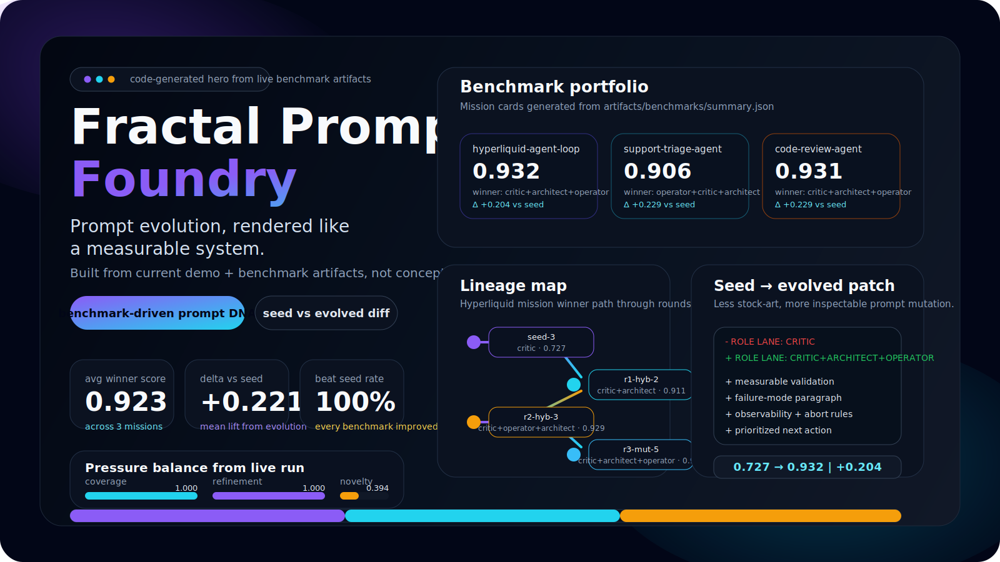
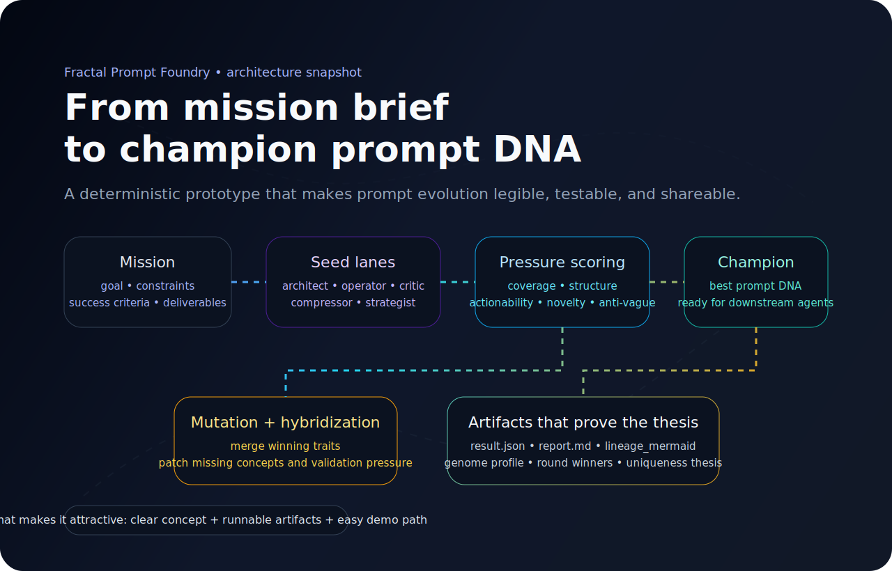

<div align="center">
  <h1>Fractal Prompt Foundry</h1>
  <p><strong>Breed better instructions before they ever hit your agents.</strong></p>
  <p><em>An offline prompt-evolution engine for multi-agent systems, research loops, and benchmarkable prompt DNA.</em></p>

  <p>
    
    
    
    
    
  </p>

  <p>
    <a href="#30-second-try">
      
    </a>
    <a href="#why-people-would-actually-use-this">
      
    </a>
    <a href="#benchmark-suite">
      
    </a>
  </p>

  

  <p><sub>Seed prompts. Pressure score them. Hybridize winners. Mutate weak spots. Keep only the strongest prompt DNA.</sub></p>
</div>

---

## What this is

Most agent systems stop at one of these patterns:

- planner → worker
- critic → retry
- static prompt template → run

**Fractal Prompt Foundry** explores a more interesting idea:

> what if prompts behaved like evolving organisms instead of fixed instructions?

Instead of retrying one weak prompt over and over, this project:

- creates a **population** of prompt candidates
- splits them into **specialist lanes**
- evaluates them with **pressure scoring**
- **hybridizes** strong candidates together
- **mutates** missing concepts and weak areas
- blocks copycats with a **novelty gate**
- returns the strongest prompt DNA before your real agents execute anything

---

## Why people would actually use this

This repo becomes interesting when you care about **instruction quality before expensive agent execution**.

### 1. It gives a system-level answer to weak prompts
Instead of manually editing one prompt, it explores a **small evolutionary search space**.

### 2. It produces inspectable artifacts, not hand-wavy claims
A run can emit:

- `result.json`
- `report.md`
- `lineage_mermaid`
- `genome_profile`
- `evolved_genome_profile`
- `evolution_summary`
- `round_summaries`
- `uniqueness_thesis`

That makes the concept easier to test, share, and extend.

New in the current version:

- `baseline_diff` for seed-vs-evolved prompt deltas
- benchmark suite outputs across multiple missions
- per-mission benchmark reports plus a portfolio summary

### 3. It is a useful prototype for bigger agent products
You can imagine this sitting before:

- coding agents
- research agents
- trading research loops
- evaluation pipelines
- orchestration layers
- prompt QA / benchmarking systems

### 4. It is easy to try
No API key, no hosted dependency, no external model call required for the current prototype.

---

## 30-second try

### Option A — run the demo

```bash
python demo.py
```

### Option B — use the built-in CLI entry

```bash
python -m fractal_prompt_foundry --rounds 4 --print-report
```

### Option C — run a custom mission JSON

```bash
python -m fractal_prompt_foundry \
  --mission-file examples/hyperliquid-mission.json \
  --rounds 4 \
  --output-dir artifacts/custom-run
```

## Benchmark suite

### Option D — run the benchmark suite

```bash
python benchmark.py
```

Artifacts are written to:

- `artifacts/demo-run/result.json`
- `artifacts/demo-run/report.md`
- `artifacts/benchmarks/summary.json`
- `artifacts/benchmarks/summary.md`
- `artifacts/benchmarks/<mission>/result.json`
- `artifacts/benchmarks/<mission>/report.md`

---

## Architecture snapshot

<div align="center">
  
</div>

---

## Why it stands out

### Prompt DNA
Prompts are treated like composable structures, not raw strings.

### Prompt genome profiling
Every winning prompt gets a **genome profile** with:

- genome ID
- prompt checksum
- lineage depth
- lane mix
- bullet density
- imperative density
- control density
- domain saturation
- pressure balance snapshot

### Mutation lanes
Different lanes push different prompt personalities:

- architect
- operator
- critic
- compressor
- strategist

### Hybridization
Top candidates can merge into stronger prompt lineages instead of relying on single-path retries.

### Novelty gate
Near-duplicate prompts get rejected so the loop stays exploratory instead of collapsing into sameness.

### Product-level artifacts
Each run can emit:

- `result.json`
- `report.md`
- `baseline_diff` with seed-vs-evolved prompt changes
- a Mermaid lineage graph of how the champion evolved
- round winners by generation
- a uniqueness thesis that explains why the run matters
- benchmark portfolio summaries across missions

---

## Core loop

```text
Mission
  ↓
Seed population of prompt lanes
  ↓
Evaluate candidate pressure
  ↓
Keep elites
  ↓
Hybridize top performers
  ↓
Mutate missing concepts
  ↓
Novelty gate rejects near-duplicates
  ↓
Repeat for N rounds
  ↓
Return strongest prompt DNA
```

---

## Demo

The included demo evolves prompts for a **Hyperliquid research-agent mission** with explicit constraints like:

- no live trading
- no fund movement
- paper-trading only
- explicit risk controls
- measurable exit conditions
- reusable outputs across specialist agents

### Real output observed
The prototype was executed successfully and now reports both the **global best candidate** and the **best evolved candidate** so you can see whether evolution actually outperformed the seed baseline.

Observed demo result:

- **Mission:** `hyperliquid-agent-loop`
- **Global best candidate:** `r3-mut-5`
- **Global best style:** `critic+architect+operator`
- **Global best score:** `0.932`
- **Best evolved candidate:** `r3-mut-5`
- **Best evolved score:** `0.932`
- **Evolution delta vs seed:** `+0.204`
- **Evolution outperformed seed:** `True`

Observed benchmark portfolio:

- **Missions:** `3`
- **Average evolved winner score:** `0.923`
- **Average delta vs seed:** `+0.221`
- **Evolution beat seed rate:** `1.0`
- **Winning lane frequency:** `critic=3`, `architect=3`, `operator=3`

Top leaderboard snapshot:

- `r3-mut-5` — `critic+architect+operator` — `0.932`
- `r2-hyb-3` — `critic+operator+architect` — `0.929`
- `r2-hyb-1` — `critic+architect+operator` — `0.929`
- `r2-hyb-2` — `critic+architect+operator` — `0.929`
- `r3-hyb-1` — `critic+operator+architect` — `0.926`

Metric snapshot for the evolved champion:

```json
{
  "coverage": 1.0,
  "structure": 1.0,
  "actionability": 1.0,
  "refinement": 1.0,
  "evolutionary_gain": 0.85,
  "novelty": 0.394,
  "anti_vague": 0.95
}
```

---

## Quickstart

### Claude Code / Codex

This repo now ships an `AGENTS.md` at the root so Claude Code, Codex, and other agent-aware tools can inherit the intended development style automatically.

What it enforces:

- keep the prototype deterministic and local-first
- prefer stdlib and small diffs
- avoid premature modularization and unnecessary dependencies
- verify changes with `python demo.py` and `python test_foundry.py`

### Clone and run

```bash
git clone https://github.com/Blackleets/fractal-prompt-foundry.git
cd fractal-prompt-foundry
python demo.py
```

### Run tests

```bash
python test_foundry.py
```

### Run the benchmark suite

```bash
python benchmark.py
```

### Use the packaged CLI locally

```bash
pip install -e .
fractal-foundry --mission-file examples/hyperliquid-mission.json --rounds 4 --print-report
```

---

## Example mission schema

```json
{
  "name": "mission-name",
  "goal": "What the target agent should achieve.",
  "constraints": ["Hard constraints go here."],
  "success_criteria": ["How the prompt should behave."],
  "deliverables": ["What the downstream agent must return."],
  "domain_terms": ["Optional vocabulary that should appear when relevant."]
}
```

See:

- `examples/hyperliquid-mission.json`
- `examples/support-triage-mission.json`
- `examples/code-review-mission.json`

---

## Contributing

If you want to improve the project or submit ideas, start here:

- `CONTRIBUTING.md`

The easiest valuable contributions right now are:

- new mission examples
- real-agent evaluators and harder benchmark missions
- richer visual diffing between generations
- SVG lineage / benchmark dashboards

---

## Project structure

```text
fractal-prompt-foundry/
├── artifacts/
│   ├── benchmarks/
│   │   ├── summary.json
│   │   ├── summary.md
│   │   └── <mission>/
│   │       ├── report.md
│   │       └── result.json
│   └── demo-run/
│       ├── report.md
│       └── result.json
├── assets/
│   ├── architecture.svg
│   ├── hero.svg
│   └── social-preview.svg
├── benchmark.py
├── CONTRIBUTING.md
├── examples/
│   ├── code-review-mission.json
│   ├── hyperliquid-mission.json
│   └── support-triage-mission.json
├── fractal_prompt_foundry.py
├── demo.py
├── test_foundry.py
├── pyproject.toml
└── README.md
```

---

## What is already working

- seed prompt populations
- specialist prompt lanes
- deterministic pressure scoring
- hybrid prompt lineage generation
- mutation rounds
- novelty gating
- leaderboard output
- genome profiling
- evolved-vs-seed reporting
- baseline diff reporting
- multi-mission benchmark suite
- lane-frequency summary across winners
- lineage reporting
- JSON + markdown artifacts
- runnable CLI path
- runnable demo
- basic tests

---

## What would make people want it even more

If you want the repo to become more desirable to developers, the highest-leverage next upgrades are:

### Near-term upgrades
- swap the deterministic evaluator for real agent calls
- add richer prompt diffs between generations with semantic grouping
- include more benchmark missions across coding / research / trading / ops
- add JSON schema validation for mission files
- export SVG lineage graphs directly, not just Mermaid

### Bigger upgrades
- Hermes integration with `delegate_task`
- local LLM / OpenAI / Anthropic / OpenRouter backends
- prompt tournaments between multiple agent families
- web dashboard for evolution history
- hosted API / SaaS version

---

## Good future use cases

This concept fits especially well for:

- coding agents
- research agents
- trading research loops
- agentic evaluation systems
- team-wide prompt optimization
- orchestration layers above existing LLM tools

---

## Positioning

**Fractal Prompt Foundry** is not just another retry loop.

It is a **prompt-breeding engine** for systems that want stronger instructions *before* expensive agent execution begins.

---

## Social preview

If you want to use a social image for GitHub/Open Graph previews, use:

- `assets/social-preview.svg`

---

## License

MIT
