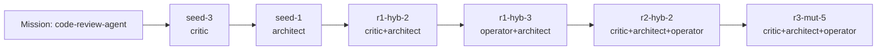

# Fractal Prompt Foundry Report — code-review-agent

## Global best candidate
- Candidate: `r3-mut-5`
- Style: `critic+architect+operator`
- Score: `0.931`
- Genome ID: `1901212ac024`

## Best evolved candidate
- Candidate: `r3-mut-5`
- Style: `critic+architect+operator`
- Score: `0.931`
- Genome ID: `1901212ac024`

## Evolution verdict
- Final round: `3`
- Seed baseline: `seed-3` → `0.702`
- Evolved best: `r3-mut-5` → `0.931`
- Delta vs seed: `0.229`
- Delta vs global best: `0.0`
- Evolution outperformed seed: `True`

## Why this run feels unique
- Treat prompts as versioned genomes instead of static templates.
- Expose lineage, pressure scores, and novelty gating as first-class artifacts.
- Champion prompt emerged from lane recombination: critic + architect + operator.

## Pressure balance
- coverage: `1.0`
- structure: `1.0`
- actionability: `1.0`
- refinement: `1.0`
- evolutionary_gain: `0.85`
- novelty: `0.391`
- anti_vague: `0.95`

## Evolved genome profile
- Lane mix: `critic, architect, operator`
- Lineage depth: `6`
- Bullet density: `1.0`
- Imperative density: `1.0`
- Control density: `1.0`
- Domain saturation: `1.0`

## Baseline vs evolved diff
- Seed baseline: `seed-3` (critic)
- Evolved champion: `r3-mut-5` (critic+architect+operator)
- Score delta: `0.229`

### Metric deltas
- coverage: `+0.000`
- structure: `+0.000`
- actionability: `+0.125`
- refinement: `+0.800`
- evolutionary_gain: `+0.850`
- novelty: `-0.213`
- anti_vague: `+0.050`

### Added prompt lines
- ROLE LANE: CRITIC+ARCHITECT+OPERATOR
- Merge the strengths of critic+architect and operator+architect. Preserve operational clarity, inject critique and edge-case pressure, and make the final output feel decisively executable.
- REFINEMENT PRESSURE:
- - Force one measurable validation step.
- - Add a failure-mode paragraph.
- - State a prioritised next action at the end.
- - Add one compact system map: inputs, decision layer, safety layer, outputs.
- - Specify one observability block with logs, metrics, and abort conditions.
- - Name the weakest assumption and how to falsify it before acting.
- - Tag this refinement pass as round 3, variant 5 in the internal planning logic.

### Removed prompt lines
- ROLE LANE: CRITIC
- Think in risks, edge cases, weak assumptions, and adversarial checks.

## Round winners
- Round 0: `seed-3` (critic) → `0.702`
- Round 1: `r1-hyb-2` (critic+architect) → `0.906`
- Round 2: `r2-hyb-3` (critic+operator+architect) → `0.924`
- Round 3: `r3-mut-5` (critic+architect+operator) → `0.931`

## Lineage graph
