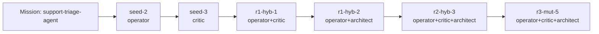

# Fractal Prompt Foundry Report — support-triage-agent

## Global best candidate
- Candidate: `r3-mut-5`
- Style: `operator+critic+architect`
- Score: `0.906`
- Genome ID: `21aa51783245`

## Best evolved candidate
- Candidate: `r3-mut-5`
- Style: `operator+critic+architect`
- Score: `0.906`
- Genome ID: `21aa51783245`

## Evolution verdict
- Final round: `3`
- Seed baseline: `seed-2` → `0.677`
- Evolved best: `r3-mut-5` → `0.906`
- Delta vs seed: `0.229`
- Delta vs global best: `0.0`
- Evolution outperformed seed: `True`

## Why this run feels unique
- Treat prompts as versioned genomes instead of static templates.
- Expose lineage, pressure scores, and novelty gating as first-class artifacts.
- Champion prompt emerged from lane recombination: operator + critic + architect.

## Pressure balance
- coverage: `1.0`
- structure: `1.0`
- actionability: `0.875`
- refinement: `1.0`
- evolutionary_gain: `0.85`
- novelty: `0.39`
- anti_vague: `0.9`

## Evolved genome profile
- Lane mix: `operator, critic, architect`
- Lineage depth: `6`
- Bullet density: `1.0`
- Imperative density: `1.0`
- Control density: `0.833`
- Domain saturation: `1.0`

## Baseline vs evolved diff
- Seed baseline: `seed-2` (operator)
- Evolved champion: `r3-mut-5` (operator+critic+architect)
- Score delta: `0.229`

### Metric deltas
- coverage: `+0.000`
- structure: `+0.000`
- actionability: `+0.125`
- refinement: `+0.800`
- evolutionary_gain: `+0.850`
- novelty: `-0.209`
- anti_vague: `+0.050`

### Added prompt lines
- ROLE LANE: OPERATOR+CRITIC+ARCHITECT
- Merge the strengths of operator+critic and operator+architect. Preserve operational clarity, inject critique and edge-case pressure, and make the final output feel decisively executable.
- REFINEMENT PRESSURE:
- - Force one measurable validation step.
- - Add a failure-mode paragraph.
- - State a prioritised next action at the end.
- - Add one compact system map: inputs, decision layer, safety layer, outputs.
- - Specify one observability block with logs, metrics, and abort conditions.
- - Name the weakest assumption and how to falsify it before acting.
- - Tag this refinement pass as round 3, variant 5 in the internal planning logic.

### Removed prompt lines
- ROLE LANE: OPERATOR
- Think in execution steps, observability, and safe operations.

## Round winners
- Round 0: `seed-2` (operator) → `0.677`
- Round 1: `r1-hyb-3` (critic+architect) → `0.886`
- Round 2: `r2-hyb-1` (critic+architect+operator) → `0.905`
- Round 3: `r3-mut-5` (operator+critic+architect) → `0.906`

## Lineage graph
