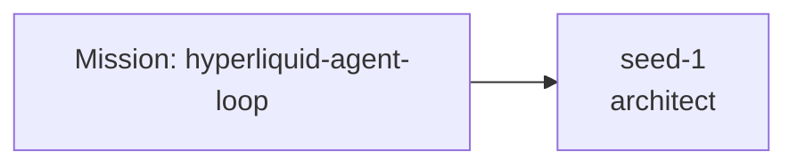

# Fractal Prompt Foundry Report — hyperliquid-agent-loop

## Champion
- Candidate: `seed-1`
- Style: `architect`
- Score: `0.995`
- Genome ID: `6667f13ac0fb`

## Why this run feels unique
- Treat prompts as versioned genomes instead of static templates.
- Expose lineage, pressure scores, and novelty gating as first-class artifacts.
- Current winner preserved high novelty instead of collapsing into prompt sameness.

## Pressure balance
- coverage: `1.0`
- structure: `1.0`
- actionability: `1.0`
- novelty: `1.0`
- anti_vague: `0.95`

## Genome profile
- Lane mix: `architect`
- Lineage depth: `1`
- Bullet density: `1.0`
- Imperative density: `0.833`
- Control density: `1.0`
- Domain saturation: `1.0`

## Round winners
- Round 0: `seed-1` (architect) → `0.995`
- Round 1: `r1-hyb-1` (architect+critic) → `0.907`
- Round 2: `r2-hyb-1` (architect+critic+architect+operator) → `0.887`
- Round 3: `r3-hyb-1` (architect+critic+architect+operator+architect+critic+critic+operator) → `0.886`

## Lineage graph
